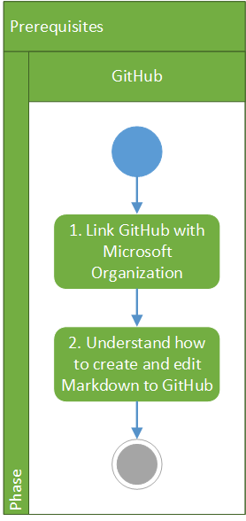
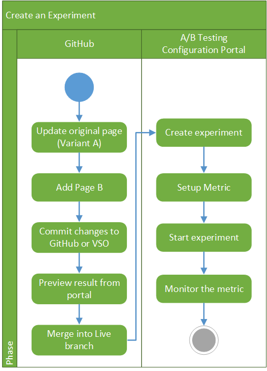
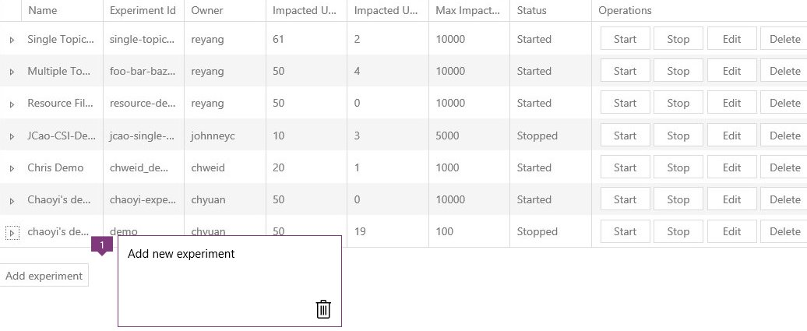
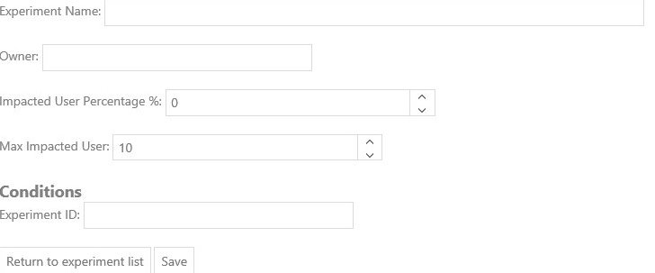
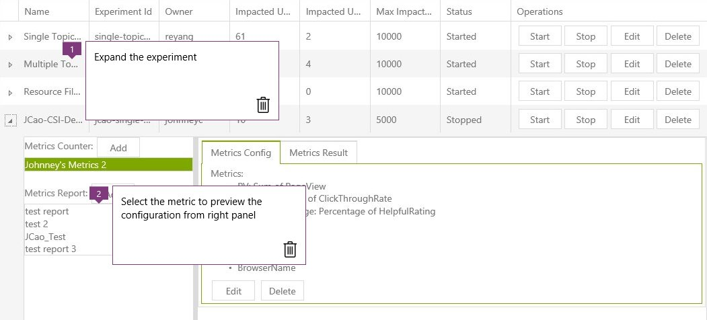
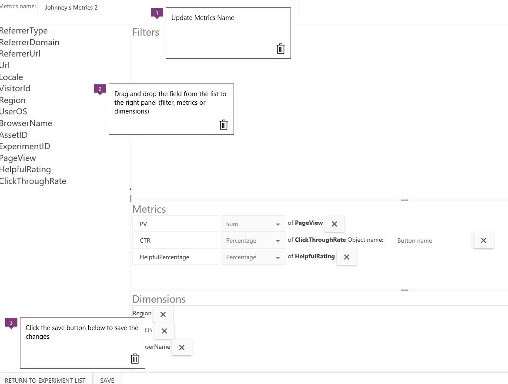
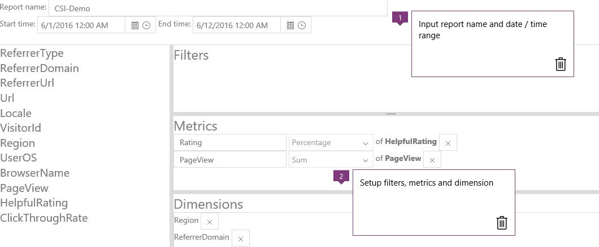
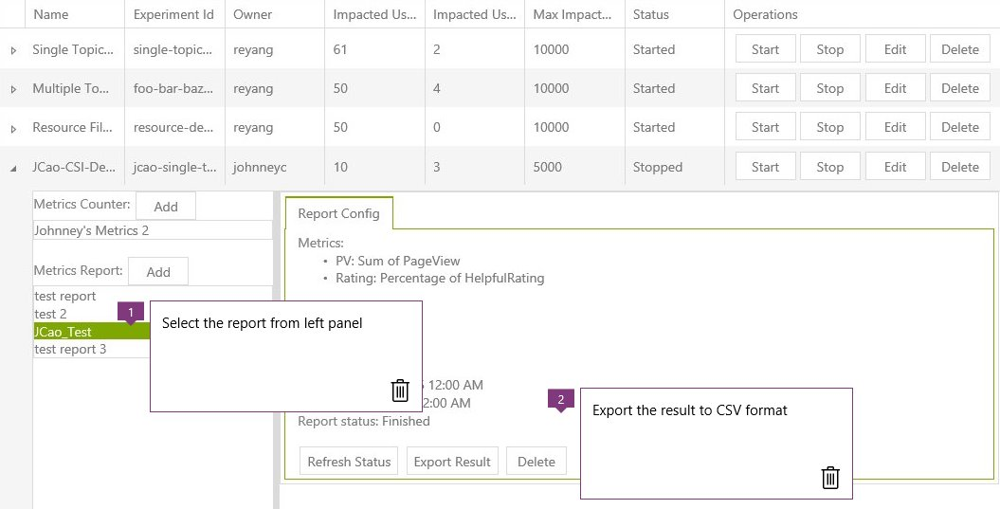
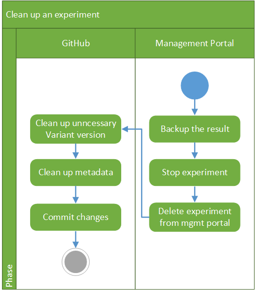

#User's Manual - Content Level A/B Testing

##Prerequisite

- Please follow the step [How to Join the Microsoft GitHub Organization](https://opensourcehub.microsoft.com/articles/how-to-join-microsoft-github-org-self-service) to link your GitHub account with Microsoft organization.
- Read the CSI instruction to understand the process how to **CREATE** / **EDIT** / **COMMIT** markdown file to GitHub. This manual really don't take content creation/revision into consideration.
- Use **working** branch before merge into Live environment which is always a **BEST PRACTICE**.

##Step-by-step

###Create a new experiment

####Part I: Set up the experimental files in your working branch.

- The A/B test requires two separate markdown files, the A variant, and the B variant. You may already have an A variant as an existing published page.

1. Switch to your **working** branch:
	- If you are working locally, switch to your local staging branch. The staging branch is whichever branch you use to commit changes that will be published to [stage endpoint](https://stage.docs.microsoft.com).

2. Edit Variant A Page:
	- Edit your source file (Page A) by adding the following metadata::
		> `experimental: true`
		> 
		> `experiment_id: "billg-font-20160229"`

		`experiment_id` is the unique id for your experiment. We recommend that your experiment id be of the form &lt;your\_alias&gt;-&lt;experiment\_name&gt;-&lt;YYYYMMDD&gt;

3. Create Variant B Page:
	- Create a Variant B page for the topic in the same folder using all of Page A's original metadata. Add the `experiment_id` field and use the same experiment ID you created for the A variant.
	- Use the following file name structure when you save the Variant B page: &lt;sourcefilename&gt;`.experimental.md`. For example:
		- If A Variant is CSI-demo.md, then B Variant should be CSI-demo.experimental.md

4. Add and commit your changes:
 	- If you are working locally, you will have to merge these local changes with the staging branch on GitHub with a pull request. If you are working on GitHub, simply commit the changes. Once the files are committed to the staging branch on GitHub,  it will automatically trigger the OP build for the staging branch.

5. Preview the result from portal:
	- Open OP Portal, wait until the build is completed without error message.

	

	- Open stage site and preview the result.

6. Merge your Variant A and Variant B to Live branch
	- Once you've confirmed that the A and B variants are available on the staging server, merge your Variant A and Variant B files to the **Live** branch for publication to the production site.

####Part II: Create an Experiment on A/B Testing Configuration Portal.

1. Create an experiment:

	- Open [A/B Configuration portal](https://abtestingportal.azurewebsites.net/#/experiments), and click **ADD EXPERIMENT** to create a new experiment.

	

		- Experiment id fields can be either `document_id` or `experiment_id` in the Variant A page. For now, please enter the `experiment_id` you created for your experiment.

	

		- Select the percentage of users who will see Variant B. The percentage can be from 0% to 100%, only integer value is allowed, and we recommend 50% as a starting point. Enter the percentage *without* a percent sign.
		- Select the maximum number of users who will see the B variant. Note that at the moment this is not enforced (the experimentation framework *will* keep track of how many users see the B variant, but it will *NOT* yet automatically shut off the experiment when that number is reached). A good number to start with is in the range of 500 – 1000.
	- Save the experiment. You will be returned to the experimentation portal front page.
	- Preview the result by adding prefix `https://stage.docs.microsoft.com/_chrome/experiment.htm#` to switch between your Page A and B.

2. Setup Metrics:
	- Expand the experiment from [A/B Configuration portal](https://abtestingportal.azurewebsites.net/#/experiments).

	

	- Click **EDIT** from **METRIC CONFIG** tab.

	

3. Start the experiment:
	- Click the **START** button to start the experiment.

	

###Monitoring and Reports
1. Monitor the metric counters:
	- Select the counter from **Metrics Counter**, and click **METRIC RESULT** to show the result. (NOTE, it will takes about 4-6 hrs to show the result because of the latency time from WEDCS)

	

2. Offline metric report:
	- Click **ADD** button on the Metrics Report from left panel to Create a report.

	

	- Click "Run Report" in the button of the foorm.
	- Export the report to .cvs file once it is **FINISHED**

	

###Clean up A/B testing once it is completed.

1. Backup the result Export the result from METRIC RESULT to Excel:
	- Open A/B Configuration portal, and select the experiment.
	- Select the Metric, click **METRIC RESULT** tab, and then click **EXPORT EXCEL** to export the result.
	- Repeat the **EXPORT EXCEL** for all the related metrics.

	

2. Stop the experiment:
	- Click the **STOP** button to stop the experiment.

	

3. Delete the experiment from [A/B Configuration portal](https://abtestingportal.azurewebsites.net/#/experiments):
	- Click **DELETE** button to remove the experiment from the list.

4. Clean up unnecessary Variant version.
	- Once the experiment is finished, you should keep the final version, and delete the unnecessary version from document repo.
		- If choose Variant A, delete the Variant B.
		- If choose Variant B, copy the content from Variant B to Variant A and delete Variant B.

5. Clean up metadata from Markdown file
	- Remove `experimental: true` and `experiment_id` from final Markdown file

6. Commit changes.

## Other Resources
- Environment: [Environments - Content Level](http://onenote:#Environments%20-%20Content%20Level&section-id={7011B86A-3C76-4C37-8F41-C26A380ADAEC}&page-id={B1125C68-7C08-49DA-A45C-8ADE3A315520}&end&base-path=https://microsoft.sharepoint.com/teams/Visual_Studio_China/Shared%20Documents/Open%20Publishing/AB%20Testing.)
